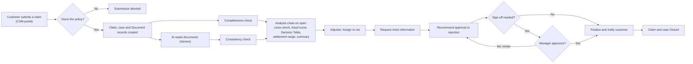

# Insurance Claim Processing Hub

**AI recommends. Humans decide.**

A ServiceNow scoped application that runs the insurance claim lifecycle in one place: customer self-service submission, document completeness and consistency checks, AI document reading, explainable fraud risk scoring, settlement guidance from historical claims, an adjuster workflow, risk-triggered manager sign-off, and live status updates for the customer.

Built by **Team BrainWave** (KL University) for **HackNow India 2026**.

---

## The problem

Before a claim can be decided, it needs four checks:

1. **Completeness:** are the required documents present?
2. **Consistency:** do the documents agree with each other and with the claim?
3. **Fraud risk:** is there any fraud signal?
4. **Settlement:** what is a fair payout?

In most claim operations these are done by hand, so results vary between adjusters and the reasoning isn't recorded. The customer can't see any of it, so status is chased by phone.

## Design principle

**AI produces evidence, never decisions.**

- Every AI output (findings, fraud score, reasons, settlement range, summary) is stored in its own field.
- Every change the customer sees comes from a person's action.
- The server validates every action: role, ownership and claim state are checked on the server, not just in the browser.
- A second human check (manager sign-off) is triggered by risk, not applied to every claim.

## Use cases covered

| Use case | How the hub handles it |
| --- | --- |
| UC1 Claim document management | Each upload becomes a Document record. Required document types per claim type come from the Claim Type Document Rules table. |
| UC2 Fraud risk assessment | Seven weighted signals produce a score with written reasons. A published Decision Table maps the score to Low, Medium or High. |
| UC3 Missing information tracking | Missing documents are detected on every save. Adjusters request information in their own words, and the customer replies on the same case. |
| UC4 Settlement recommendation | A range based on the three most similar historical claims, with the reference claims listed. |
| UC5 Claim status tracking | Customers follow plain-language updates on their CSM case. Internal notes, scores and AI output are never shown to them. |

## Claim flow

## Architecture

| Layer | Components |
| --- | --- |
| Customer | Customer Service Management portal, **Submit a Claim** record producer, header menu item |
| Data | Scoped App Engine app (`x_snc_insurance_0`): Claim, Document, Policy, Claim Type Document Rules, Historical Claim |
| Automation | Business rules: completeness and consistency on every claim save, asynchronous AI read on every new document, analysis chain when a claim is opened |
| Intelligence | Gemini API over REST for document reading, two custom Now Assist skills (cross-check, adjuster summary), FraudRiskScorer with a Decision Table, SettlementRecommender |
| Workflow and governance | Client-callable script include for adjuster and manager actions with server-side role checks, ACLs, customer comments vs internal work notes, manager sign-off |
| Insight | Platform Analytics dashboard: claims by status, fraud risk distribution, claims awaiting manager sign-off |

## Main components

### Tables

| Table | Purpose |
| --- | --- |
| `x_snc_insurance_0_claim` | The claim, its checks, AI fields, fraud score, settlement range, adjuster decision and sign-off status |
| `x_snc_insurance_0_document` | One record per uploaded file, with AI-extracted JSON, date and amount |
| `x_snc_insurance_0_policy` | Policies, each linked to its owner |
| `x_snc_insurance_0_claim_type_document_rules` | Which document types each claim type requires |
| `x_snc_insurance_0_historical_claim` | Past settled claims used for settlement guidance and the fraud amount check |

### Script includes

| Script include | What it does |
| --- | --- |
| `ClaimCompletenessChecker` | Checks required documents and document-to-claim consistency, and posts customer-visible status messages on the linked case |
| `DocumentAIReader` | Sends each document to Gemini, stores the structured result, and runs the analysis chain: cross-check, fraud score, settlement, summary |
| `FraudRiskScorer` | Calculates the weighted fraud score and reasons, and maps the score through the Decision Table |
| `SettlementRecommender` | Builds the settlement range from the three closest historical claims |
| `IRISPolicyLookup` | Client-callable. Returns policy details only to the policy owner, for the submission form |
| `IRISRequestInfo` | Client-callable. Request information, recommend approval or rejection, finalize, and manager approve or decline, each validated on the server |

### Business rules

- **Claim - Check document completeness** (before insert/update)
- **Document - Recheck claim completeness** (after insert/update/delete)
- **AI read file** (async, on document insert/update)
- **Auto-run AI analysis on open** (display, runs once until a document changes)
- **Claim - Adjuster assigned** (sets Adjuster Review and notifies the customer)

### Adjuster and manager actions

| Button | Who | Effect |
| --- | --- | --- |
| Assign to me | Adjuster | Takes the claim from the Claims Adjusters queue |
| Request more information | Assigned adjuster | Sends the adjuster's own question to the customer and sets Missing Info |
| Recommend approval | Assigned adjuster | Records the approved amount and checks the sign-off rule |
| Recommend rejection | Assigned adjuster | Records a mandatory reason (internal) |
| Finalize and notify customer | Assigned adjuster | Sends the outcome message and closes the claim and case. Blocked while sign-off is pending |
| Manager approve / Manager decline | Manager | Clears the sign-off, or sends the claim back with a reason |

## Fraud risk scoring

| Signal | Points |
| --- | --- |
| Documents inconsistent with the claim | +20 |
| AI cross-check found mismatches | +20 |
| Claim is at least 90% of the coverage limit | +15 |
| Policy is not active | +25 |
| Policy started less than 30 days before the incident | +20 |
| Amount is more than 1.4x similar historical claims | +17 |
| Missing documents | +10 |

The **Fraud Risk Level Mapping** Decision Table turns the score into a level and an action:

| Score | Level | Recommended action |
| --- | --- | --- |
| 0–30 | Low | Standard review |
| 31–60 | Medium | Manager review recommended |
| 61–100 | High | Escalate for fraud investigation |

## Manager sign-off rule

A recommendation needs manager sign-off when:

- **Approval:** the fraud level is High, or the approved amount is more than 15% below the low end of the suggested range, or more than 25% above the high end. If the range can't be read, sign-off is required by default.
- **Rejection:** the fraud level is High.

Underpayment is checked as well as overpayment, so no customer is underpaid on one person's call.

## Roles

| Persona | Roles |
| --- | --- |
| Customer | `snc_external`, `sn_customerservice.consumer` |
| Adjuster | `x_snc_insurance_0.claim_user`, `x_snc_insurance_0.document_user`, `sn_customerservice_agent` |
| Manager | `sn_customerservice_manager` plus the adjuster's app roles |

Customers can read only their own policies, and see only customer-visible comments on their case. Work notes and field changes stay internal.

## Installation

### Requirements

- A ServiceNow instance with **Customer Service Management** and its customer portal (`/csm`)
- **Now Assist**, for the two custom skills
- A **Gemini API key**

### Steps

1. **Import the app.** If this repository holds the Studio source-control export, use **Import from Source Control** in Studio or App Engine Studio with this repository's URL. If it holds an update set XML, use **System Update Sets → Retrieved Update Sets → Import Update Set from XML**, then preview and commit.
2. **Set the system properties:**
   - `x_snc_insurance_0.ai_api_key`: your Gemini API key
   - `x_snc_insurance_0.ai_model`: the main model
   - `x_snc_insurance_0.ai_model_fallback`: backup models
3. **Load reference data** if your import doesn't include it: Claim Type Document Rules for each claim type, Historical Claim records, and Policy records with a policy owner.
4. **Check the Now Assist skills** (Claim Adjuster Summary, Claim Document Cross Check) are present and active. Recreate them if your import didn't bring them over.
5. **Set up users:** a Claims Adjusters group, customer users with consumer records, an adjuster and a manager with the roles above.
6. **Portal entry:** add a **Submit a Claim** item to the CSM header menu that points to the record producer.
7. **Outbound email** needs a mail account configured on the instance. Without one, notifications are generated but not sent.

## Testing

- A 74-case manual test plan covering completeness, AI reading, consistency, fraud scoring, settlement, security and the customer portal
- Two Automated Test Framework (ATF) tests:
  - **Fraud Risk Scoring:** a Motor claim with known issues scores 40, Medium
  - **Settlement Recommendation:** a Motor claim returns a range with exactly three historical references
- End-to-end runs of the adjuster and manager workflow with separate customer, adjuster and manager accounts

## Known limitations

- The Gemini call uses a scripted REST call, not an IntegrationHub spoke.
- Manager sign-off is custom logic, not the native Approvals Engine.
- A customer's reply doesn't move the claim back into review automatically. The adjuster does that.
- Customers send extra documents as case attachments. These aren't linked to Document records automatically.
- Email delivery depends on the instance's mail configuration.

## Roadmap

- Move the Gemini call into an IntegrationHub spoke
- Orchestrate the lifecycle with Flow Designer
- Use the native Approvals Engine for sign-off
- Resume a claim automatically when the customer replies
- Link case attachments to Document records
- Extend beyond Motor, using the historical data already held for health, property and travel claims

## Team BrainWave

- Addithya S
- Jathin Sekhar Nerella
- Adapa Nishith Reddy
- Daida Tejan Reddy
- Akili Dedeepya

KL University · HackNow India 2026
